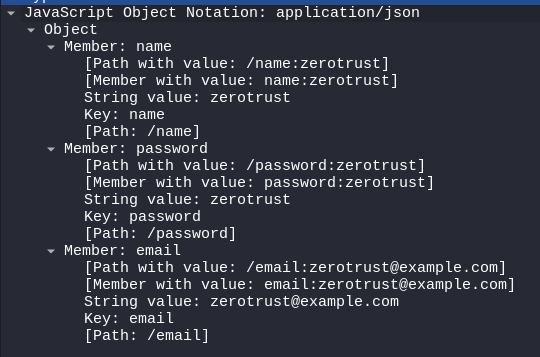

# Versão 2: Salvar Usuário, HTTP Sem TLS/SSL

Esta é a segunda versão da API, cujo objetivo principal é analisar como os dados são transmitidos sem o uso de TLS/SSL. Nesta etapa, a API realiza o registro de usuários e é testada quanto à segurança na transmissão dos dados, utilizando ferramentas como cURL para enviar requisições e Wireshark para interceptação e análise do tráfego HTTP em texto claro.

---

## Introdução

Nesta versão, a API foi configurada para operar via HTTP puro, sem qualquer camada de criptografia. O foco deste estágio é:

- **Entender a transmissão de dados sem criptografia:**  
  Analisar, com o auxílio do Wireshark, como dados sensíveis (nome, senha e email) são enviados em texto claro, evidenciando os riscos de segurança.

- **Testar a vulnerabilidade a ataques:**  
  Simular um cenário onde um atacante, com acesso à rede, pode interceptar e visualizar dados sensíveis.

---

## Desenvolvimento

### Dependências

Antes de iniciar a aplicação, restaure os pacotes do projeto com o seguinte comando:

```bash
    dotnet restore
```

---

## Endpoints e Implementação

A API possui apenas um endpoint principal definido na classe UserController.cs na pasta User/Controllers. Nesta versão, o endpoint de registro do usuário é utilizado para demonstrar a transmissão de dados sensíveis.

### Testando o Endpoint

- **Requisição com cURL**

1. Esteja rodando na máquina hospedeira o projeto e no seu ambiente linux, rode o comando:

```bash
    curl -X POST http://192.168.56.1:5000/api/user/register \
    -H "Content-Type: application/json" \
    -d '{"name":"admin","password":"admin","email":"zeroadmintrust@example.com"}'
```

Este comando simula uma requisição de registro de usuário, enviando dados sensíveis (nome, senha, email) em formato JSON por HTTP.

---

## Interceptação e Análise com Wireshark

- **Configuração do Wireshark:** No Kali Linux, abra o Wireshark e selecione a interface de rede utilizada para a comunicação com o host (ex.: eth0).

- **Aplicação do Filtro:** Utilize o filtro http para capturar apenas os pacotes relevantes.

- **Observação dos Dados:** Execute a requisição via cURL e analise os pacotes interceptados. Você poderá visualizar os dados enviados em texto claro, evidenciando:
    - Nome do usuário
    - Senha
    - Email

- 

- **Risco Detectado:** Como os dados trafegam sem nenhuma proteção, qualquer pessoa com acesso à rede pode interceptar e visualizar informações confidenciais.

---

## Relatório: Lições Aprendidas

- **Transmissão sem Criptografia é Arriscada:** A análise demonstrou que, sem a proteção de TLS/SSL, dados sensíveis trafegam em texto claro e podem ser facilmente comprometidos.

- **Importância dos Testes com Wireshark:** O uso do Wireshark permitiu visualizar, em tempo real, como os dados são transmitidos, corroborando a necessidade de um canal seguro.

- **Iteratividade no Desenvolvimento de Segurança:** O projeto reforça a ideia de que a segurança deve ser um ciclo contínuo de testes, análises e melhorias. Cada iteração fornece aprendizados que são fundamentais para evoluir a aplicação.

Esta versão da API deixa claro o quão vulnerável é a transmissão de dados via HTTP puro. Sem a proteção de TLS/SSL, informações sensíveis podem ser facilmente interceptadas, o que representa um grande risco em ambientes de produção.

### Próximos Passos

1. **Implementação de TLS/SSL:** Na próxima versão, a API será configurada com HTTPS para criptografar os dados em trânsito, protegendo os usuários contra interceptações maliciosas.

2. **Continuação dos Testes de Segurança:** Após a implementação do HTTPS, os mesmos testes de interceptação serão repetidos com Wireshark para comprovar a eficácia da criptografia.

---

*Vítor – Estudante de Cibersegurança | SOC | Desenvolvimento*