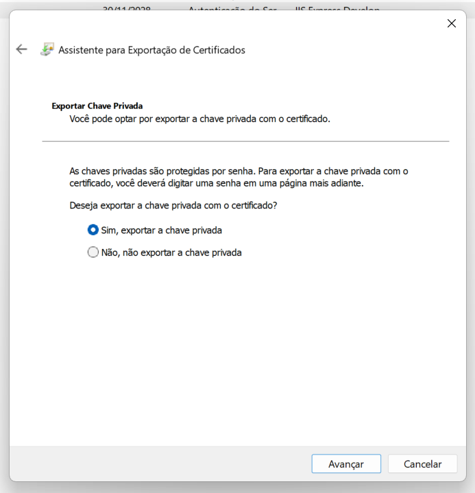

# Versão 3: Salvar Usuário, HTTP Com TLS/SSL

Nesta terceira versão da API, mantivemos as mesmas rotas da versão anterior, porém agora a comunicação é criptografada via HTTPS, garantindo a proteção dos dados em trânsito. Nesta etapa, o objetivo é demonstrar a evolução da segurança, mitigando os riscos anteriormente identificados na transmissão por HTTP puro.

---

## O que foi Alterado?

- **Implementação do TLS/SSL:** Agora a API utiliza um certificado autoassinado para criptografar a comunicação. Essa mudança impede que dados sensíveis (nome, senha e email) sejam transmitidos em texto claro, eliminando a vulnerabilidade de interceptação por terceiros.

- **Geração e Exportação do Certificado:** Foi gerado um certificado autoassinado para o domínio localhost. O certificado foi exportado no formato PFX contendo a chave privada, permitindo sua utilização no ambiente .NET para configurar o servidor com HTTPS.

- **Configuração do Kestrel:** No arquivo Program.cs, o Kestrel foi configurado para escutar em todas as interfaces na porta 5000 utilizando o certificado PFX. Dessa forma, as requisições agora são processadas de forma criptografada.

---

### Dependências

Antes de iniciar a aplicação, restaure os pacotes do projeto com o seguinte comando:

```bash
    dotnet restore
```

---

## Passo a Passo: Gerando e Utilizando um Certificado Autoassinado no Windows

1. **Gerar um Certificado Autoassinado via PowerShell**
  
    Abra o PowerShell e execute o seguinte comando para criar um certificado autoassinado válido para localhost:

    ```powershell
      New-SelfSignedCertificate -DnsName "localhost" -CertStoreLocation "cert:\LocalMachine\My"
    ```
    Esse comando criará um certificado que poderá ser utilizado para criptografar a comunicação.

2. **Exportar o Certificado com a Chave Privada (Formato PFX)**
  
    Para usar o certificado no .NET, é necessário exportá-lo em formato PFX. Siga o passo a passo.
    - **Abrir o Gerenciador de Certificados:**
      - Pressione Win + R e digite: certlm.msc
      - Vá até: Pessoal > Certificados
      - Localize o certificado criado com o nome localhost.
      - Clique com o botão direito sobre o certificado e selecione: Todas as Tarefas > Exportar > Avançar
      - Escolha a opção Exportar Sim, exportar a chave privada
      - Não altere nada e depois Avançar
      - Defina uma senha para a proteção do arquivo
      - Troque a criptografia para AES256-SHA256
      - Escolha o caminho onde quer salvar o seu certificadoe e exporte

      <div style="display: flex; flex-wrap: wrap; gap: 10px;">
        
        
        
        
        
        
      </div>


3. **Configurar o Kestrel no Projeto (.NET)**
  
    Abra o arquivo Program.cs e adicione (ou ajuste) a seguinte configuração para utilizar o certificado PFX:

    ```csharp
      // Configura o Kestrel para escutar em todas as interfaces na porta 5000
      builder.WebHost.ConfigureKestrel(options =>
      {
          // Substitua 5000 pela porta desejada; utiliza um certificado autoassinado
          options.Listen(System.Net.IPAddress.Any, 5000, listenOptions =>
          {
              listenOptions.UseHttps("nomeDoSeuCertificado.pfx", "suaSenha");
          });
      });
    ```
    > Nesta configuração, o Kestrel usará o seu certificado com a sua senha definida para criptografar as comunicações HTTPS.

---

### Testando o Endpoint

- **Requisição com cURL:** Esteja rodando na máquina hospedeira o projeto e no seu ambiente linux, rode o comando:

  ```bash
      curl -k -X POST https://192.168.56.1:5000/api/user/register \
      -H "Content-Type: application/json" \
      -d '{"name":"zerotrust","password":"zerotrust123","email":"zerotrust@example.com"}'
  ```

  Quando utilizamos um certificado autoassinado, o certificado não é emitido por uma autoridade certificadora confiável. Por padrão, o cURL realiza a verificação da autenticidade dos certificados SSL/TLS, e isso faz com que conexões com certificados não verificados sejam recusadas.
  
  A opção -k (ou --insecure) instrui o cURL a ignorar a verificação do certificado do servidor. Assim, mesmo que o certificado não seja reconhecido como confiável, o cURL procede com a requisição. Essa prática é segura apenas em ambientes de teste e desenvolvimento, pois em produção é imprescindível utilizar certificados emitidos por autoridades confiáveis para garantir a segurança das comunicações.

---

## Interceptação e Análise com Wireshark

- **Configuração do Wireshark:** No Kali Linux, abra o Wireshark e selecione a interface de rede utilizada para a comunicação com o host (ex.: eth0).

- **Aplicação do Filtro:** Utilize o filtro http para capturar apenas os pacotes relevantes.

- **Observação dos Dados:** Execute a requisição via cURL e analise os pacotes interceptados. Você poderá visualizar os pacotes enviados, mas não será possível entender, pois os dados estão criptografados.

---

## Resumo: Riscos Mitigados e Lições Aprendidas

1. **Vulnerabilidade Anterior:**
    - **Transmissão em Texto Claro:** Na versão anterior, os dados sensíveis eram transmitidos via HTTP sem qualquer criptografia, permitindo que qualquer pessoa com acesso à rede interceptasse e lesse esses dados.

2. **Riscos:**
    - **Interceptação e Captura de Dados:** Um atacante poderia facilmente capturar dados como nome, senha e email, comprometendo a privacidade e integridade dos usuários.

3. **Evolução com TLS/SSL:**
    - **Criptografia de Dados:** Ao implementar o TLS/SSL, a comunicação agora é criptografada, impedindo a leitura dos dados interceptados.
    - **Redução de Riscos:** A utilização de um certificado autoassinado garante que, mesmo em ambientes de teste, a transmissão de informações sensíveis não fique exposta a interceptações maliciosas.

---

## Conclusão

Esta versão reforça a importância de utilizar protocolos seguros (HTTPS) para proteger informações críticas. A transição de HTTP para HTTPS demonstra claramente a evolução do projeto, consolidando a prática de continuamente revisar e melhorar a segurança em cada iteração do desenvolvimento.

---

> *Vítor – Estudante de Cibersegurança | SOC | Desenvolvimento*